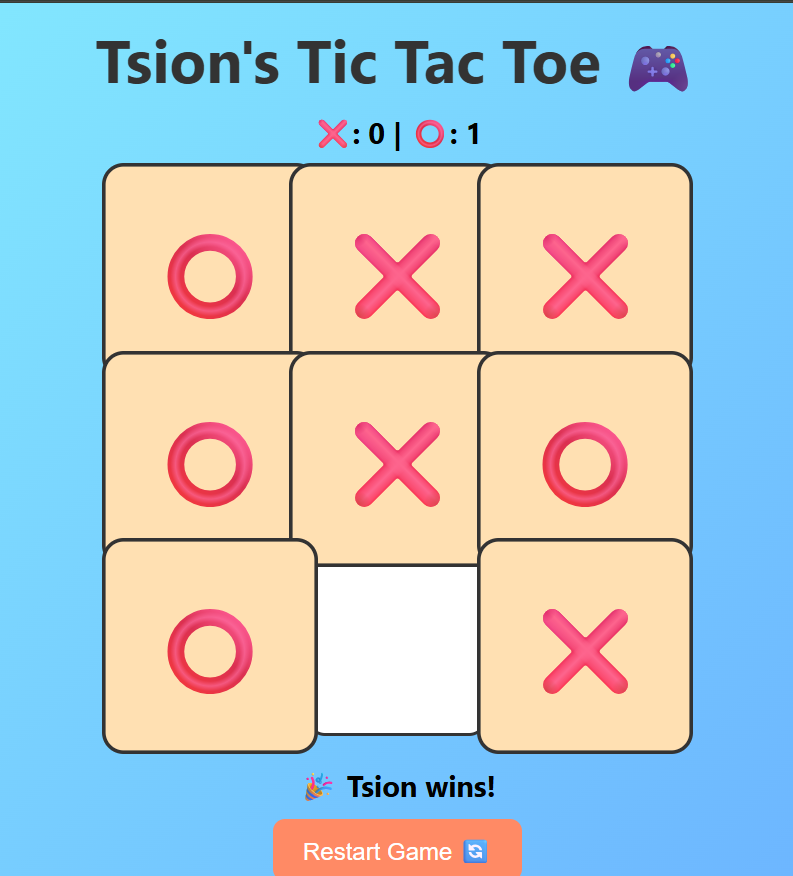

# Tic Tac Toe 🎮

## Project Overview 📝
This is a **web-based Tic Tac Toe game** implemented with HTML, CSS, and JavaScript.  Two players take turns to 
place ❌ and ⭕ on a 3x3 board.  The game automatically detects wins, draws, and keeps track of the score.  

Player ⭕ is always **Tsion**, adding a personal touch to the game.

---

## Features ✨
- Two-player mode 🧑‍🤝‍🧑 (Player ⭕ = Tsion)  
- Win/draw detection 
- Emoji based X and O marks ❌⭕  
- Dynamic scoreboard 
- Hover and click animations  
- Board resets for a new game 🔄  



---

## How to Play ▶️
1. Clone the repository:  
   ```bash
   git clone https://github.com/tsion-syseng/Tic-Tac-Toe-Web.git
